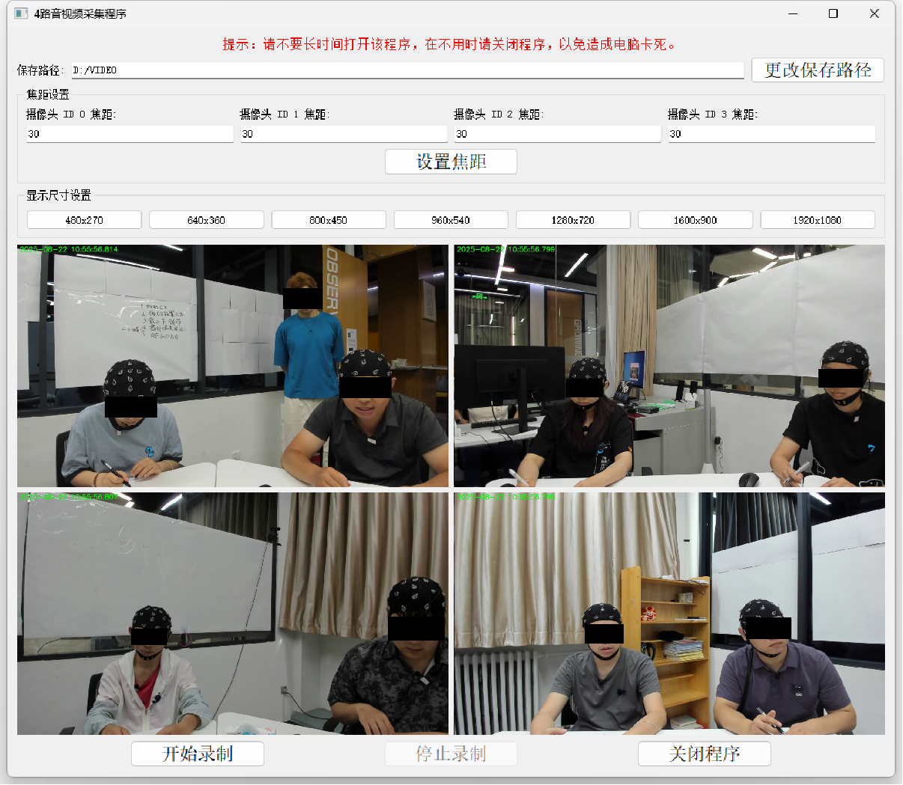

# Multi-video-and-audio-synchronous-recording-program

## 介绍
此软件是一个基于 Python 的多通道音视频同步采集系统。它利用 PyQt5 作为图形用户界面(GUI)框架，结合 OpenCV 进行视频处理、PyAudio 进行音频采集，旨在提供一个可配置、稳定且易于操作的数据采集工具。该软件的核心特色是其动态性与同步性。用户可以通过简单的 config.json 配置文件来决定要启用的摄像机与麦克风数量，程序会自动侦测硬件并动态生成对应的界面与控制线程。此外，程序内置了时钟程序以及一套自定义的同步屏障机制，确保所有影音录制线程能在同一时间点精准启动，并且能够实现采集过程中多通道音视频的逐帧同步，这对于后续需要进行多模态数据分析的应用场景至关重要。

本程序具备多项核心功能。首先是动态通道配置，用户可通过 `config.json` 文件设置 `video_num` 参数来决定启用的影音通道数量，无需修改代码。其次，程序启动时会自动扫描并验证系统中可用的摄像机数量，若与配置不符则会提示错误，增加了系统的稳健性。软件为所有启用的摄像机通道提供即时的影像预览，并允许用户为每一路摄像机独立设置焦距值(0-255)且保存设置。同时，用户可以方便地调整预览窗口的大小，并随时更改录制文件的存储目录。在录制方面，程序支持同步启动所有通道的音视频录制，将文件存于以时间戳命名的文件夹中，并在视频画面上叠加精确到毫秒的时间戳。最关键的是，通过自定义的同步屏障，程序能确保所有存储线程在同一时刻开始写入数据，并且此屏障在视频每帧以及音频每1470Hz的同步，保证了多通道数据的同步性。

在设计模式上，本程序采用了典型的多线程架构，以确保高性能的数据采集与流畅的用户界面体验。UI 主线程负责渲染与用户交互，而所有耗时的硬件读写任务均被分配到独立的背景线程中。其中，每个视频与音频采集都会分配一个采集线程 (`CameraThread`, `AudioThread`) 负责从硬件设备持续读取数据并存入线程安全的全局缓冲区；同理每个视频与音频存储都会分配一个存储线程 (`VideoSaverThread`, `AudioSaverThread`) 则在用户发出录制指令后被创建，它们通过绝对时钟以固定速率（30FPS）从缓冲区获取数据并写入硬盘，实现了采集与存储的逻辑解耦。为了防止数据竞争，程序使用 `threading.Lock` 保护对全局缓冲区的并发访问。
存储线程中最关键的设计是 `sync_barrier_function` 函数，它与 `threading.Event` 对象共同构成了一个集中式屏障。所有存储线程在准备就绪后会在此屏障前等待，直到主线程确认全部准备完毕后，通过一个事件信号同时唤醒所有线程，使它们几乎在同一时刻开始执行录制循环。同时，线程内部通过与全局启动时间进行比对和精准休眠，实现了稳定的帧率控制，并且在每帧中同样设置了所有视频和音频线程的屏障与等待机制，确保所有视频采集一帧（音频采集1470Hz）才会进入下一帧采集，确保了最终数据的同步。

该程序在设计上有几处亮点。首先是其优秀的可扩展性，整个应用架构围绕 video_num 变量动态构建，使得增加或减少采集通道变得非常容易。其次是程序的稳健性，启动时的硬件检查机制能有效防止因设备未连接或驱动问题导致的运行时错误。另外，设计的用于帧同步的全局时钟程序控制绝对帧数以及多视频与音频间采集线程同步屏障与等待机制实现了绝对的时间同步，其绝对的时钟对齐要求也大幅减轻了因性能波动情况下累积延时误差导致的掉帧风险。此外，由于采集与UI线程通过信号机制异步通信，实现了低延迟的流畅预览。最后，资源隔离的设计将采集和存储逻辑分开，使得预览功能不会受到磁盘I/O性能的干扰，也使得同步可以仅从存储进行而避开了采集部分的阻塞风险，保证了稳定的帧同步。因此，此多通道音视频同步采集程序是一个功能完整、设计稳健的实用工具，其动态配置的特性使其具有良好的扩展性，能够适应不同规模的采集任务。尽管在性能和功能上仍有优化空间，但其目前的架构已为未来的扩展奠定了坚实的基础。

## 需要进行的准备工作

在采集前，需要根据场景需要严格控制接入摄像头与麦克风总数，可通过计算机外部硬件接入以及计算机内部“设备管理器”的启用禁用管理来控制。例如，对于需要4通道视频音频的Zoomin团体任务场景，应当接入4摄像头以及4麦克风（本项目硬件接入的是4个罗技c1000s相机，其自带摄像头与麦克风）。
此外，需要在config.json 配置文件中设置"video_num"的值，例如对于需要4通道视频音频任务场景，将"video_num"的值改为4即可。（不过本软件音频视频数量一致，因为使用的是自带音频的逻辑相机，若想数量不一致（比如4个视频+1个音频），那么需要您自行修改）

此外，`config.json`的其他参数可以不管，因为在软件界面中可以设置，此处仅做参数保存留档

## 采集软件界面介绍
多通道音视频同步采集软件的用户界面如图所示。该界面遵循简洁、直观的设计原则，旨在为实验人员提供强大功能的同时，确保操作的便捷性与实时监控的有效性。

      
    <em> 
    图1: 采集界面（4视频4音频为例）
    </em>

整个界面主要分为三个核心功能区域：

### 参数配置与状态显示区（顶部）：

保存路径设置：用户可以一键自定义数据存储位置，软件会将每次记录的多视频多音频文件夹命名为当前的绝对时间并存入此路径，方便数据管理。
摄像头焦距状态：提供了“设置焦距”功能，可以根据摄像状态手动调整每个固定焦距，在相机与场景固定的情况下，固定焦距相比与自动焦距更具稳定，更利于后期算法分析。
显示窗口分辨率选择：可以选择显示界面处实时视频流的分辨率，具有从 480x270 到 1920x1080 的多种分辨率预设选项，便于放大界面的细节观察及缩小界面减少占用。

### 多视角实时监控区（中部）：

这是界面的核心区域，以 2x2 的网格布局实时显示全部3到4个摄像头的视频画面。这种设计使得实验人员可以一览无余地同步监控所有受试者的行为动态以及整个实验场景的全貌。
每个视频窗口的左上角都叠加了精确到毫秒的时间戳，这对于后期的数据分析与多模态信息对齐至关重要。

### 主控制区（底部）：

包含三个关键的操作按钮：“开始录制”、“停止录制”和“关闭程序”。其功能明确，设计简洁，让用户可以轻松地启动、终止数据采集任务以及安全地退出程序，并且在录制中会具有颜色与文字提示，另外“停止录制”按钮在未录制时不可用，“开始录制”按钮则在录制时不可用，有效避免了误操作的可能。
总体而言，该采集界面将参数配置、实时监控与核心控制三大功能高效地整合在同一窗口中，实现了“所见即所得”的操作体验，极大地提高了多模态数据采集工作的效率与可靠性。
